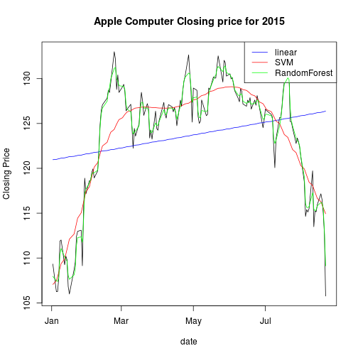

Compare Machine Learning Predictors
========================================================
author: Dr. James Muguira
date: 8/22/2015

Synopsis
========================================================

My application presents a comparison of machine learning techniques.  The application draws data for a stock from finance.yahoo.com over a date range and fits the 3 models to the draw.  In each case, the root mean square error of the fit is computed and a plot of the prediction is shown.

- Linear model
- Support vector machine
- Random forest

Background and data processing
========================================================

This demostrates the data processing to produce a comparison for one sample stock symbol. 


```r
getSymbols("AAPL")
apple <- as.data.frame(Cl(AAPL['2015']))
indx <- 1:dim(apple)[1]
r <- rownames(as.data.frame(apple))
aapl <- cbind(indx, as.Date(r), apple)
colnames(aapl) <- c("indx", "date", "close")
modelGLM <- glm(aapl$close ~ aapl$indx)
predictedY <-predict(modelGLM, aapl)
modelSVM <- svm(aapl$close ~ aapl$indx)
predictedSVM <- predict(modelSVM, aapl)
modelRF <- train(aapl$close ~ aapl$indx, data=aapl)
predictedRF <- predict(modelRF, aapl)
```

Comparision of machine learning predictors
========================================================

 

Conclusion
========================================================

While linear models compute very quickly they have to used with caution.  For streamed data feeds they can be useful for creating a prediction on very short sequences of data (perhaps a few days to a week).  While is it not shown, linear models combined with lagged data can provide a quick easy way to predict the closing price from historical data.

Support vector machines and random forest techniques provide better prediction capabilities at the cost of computational time.  However, even though these techniques do a better job of fitting the data they have to be combined with other techniques to realize a suitable stock trading system.
